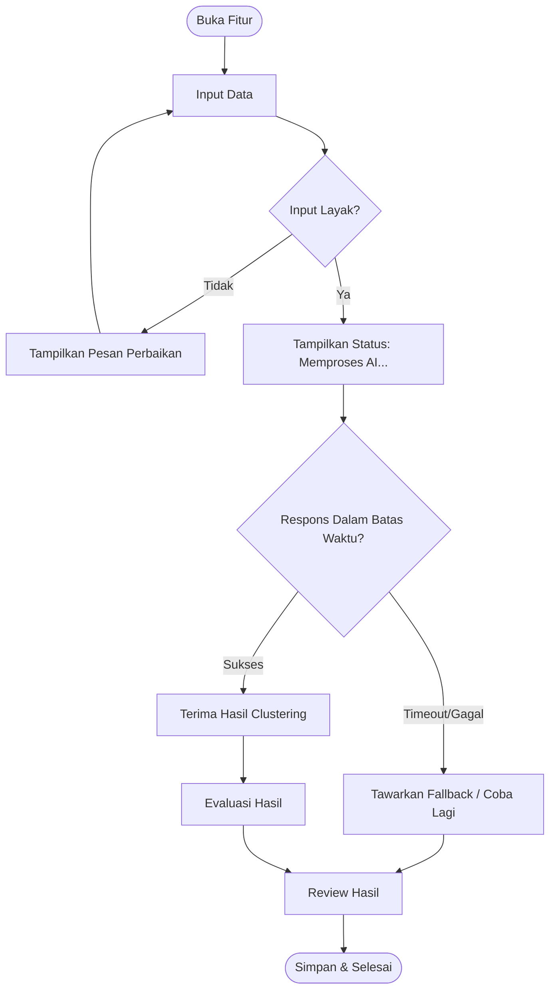

# USER STORIES & REQUIREMENTS VALIDATION

## Sistem Analisis Kedisiplinan Pegawai Berbasis K-Means

---

# 1. Informasi Dokumen

| Item           | Keterangan                                            |
| -------------- | ----------------------------------------------------- |
| Produk         | Sistem Analisis Kedisiplinan Pegawai Berbasis K-Means |
| Dokumen        | User Stories & Requirements Validation                |
| Platform       | Website `[ASUMSI]`                                    |
| Fitur AI Utama | ★ K-Means Clustering                                  |
| Prioritas      | Must dan Should                                       |
| Status         | Draft                                                 |

### Dokumen Acuan

1. `prd.md`
2. `srs.md`
3. `use-case.md`
4. `user-flow.md`
5. `acceptance-criteria.md`

> **Catatan:** Nilai atau requirement yang belum didukung dokumen sebelumnya tetap ditandai `[ASUMSI]` atau `[BELUM DITENTUKAN]`.

---

# 2. Daftar User Story

| ID    | User Story                                                                                                                                                                                                                     | FR Asal      | Prioritas | Kategori   |
| ----- | ------------------------------------------------------------------------------------------------------------------------------------------------------------------------------------------------------------------------------ | ------------ | --------- | ---------- |
| US-01 | Sebagai **pengelola kepegawaian `[ASUMSI]`**, saya ingin masuk ke sistem menggunakan akun yang valid, agar saya dapat mengakses fungsi pengelolaan dan analisis data presensi.                                                 | FR-01        | Must      | Fitur Inti |
| US-02 | Sebagai **pengelola kepegawaian `[ASUMSI]`**, saya ingin memasukkan data presensi pegawai, agar data tersebut dapat digunakan sebagai dasar analisis kedisiplinan.                                                             | FR-02        | Must      | Fitur Inti |
| US-03 | Sebagai **pengelola kepegawaian `[ASUMSI]`**, saya ingin menggunakan persentase kehadiran sebagai data analisis, agar tingkat kehadiran pegawai dapat menjadi bagian dari pengelompokan kedisiplinan.                          | FR-03        | Must      | Fitur Inti |
| US-04 | Sebagai **pengelola kepegawaian `[ASUMSI]`**, saya ingin menggunakan persentase pemenuhan jam kerja sebagai data analisis, agar pemenuhan jam kerja dapat menjadi bagian dari pengelompokan kedisiplinan.                      | FR-04        | Must      | Fitur Inti |
| US-05 | Sebagai **pengelola kepegawaian `[ASUMSI]`**, saya ingin menjalankan **K-Means Clustering ★** pada data presensi, agar data pegawai dapat dikelompokkan berdasarkan kemiripan karakteristik kehadiran dan pemenuhan jam kerja. | FR-05        | Must      | Fitur AI ★ |
| US-06 | Sebagai **pengelola kepegawaian `[ASUMSI]`**, saya ingin memperoleh kelompok hasil K-Means ★, agar saya dapat mengetahui pengelompokan tingkat kedisiplinan pegawai.                                                           | FR-06        | Must      | Fitur AI ★ |
| US-07 | Sebagai **pengelola kepegawaian `[ASUMSI]`**, saya ingin melihat hasil pengelompokan kedisiplinan, agar saya dapat menggunakan informasi tersebut untuk membantu monitoring dan evaluasi.                                      | FR-07, FR-09 | Must      | Fitur AI ★ |
| US-08 | Sebagai **pengelola kepegawaian `[ASUMSI]`**, saya ingin melihat nilai Silhouette Score ★, agar saya dapat mengetahui kualitas hasil pengelompokan yang dihasilkan.                                                            | FR-08        | Must      | Fitur AI ★ |
| US-09 | Sebagai **pengelola kepegawaian `[ASUMSI]`**, saya ingin memilih periode data presensi yang akan dianalisis, agar hasil pengelompokan sesuai dengan periode yang ingin saya evaluasi.                                          | FR-10        | Should    | Fitur Inti |
| US-10 | Sebagai **pengelola kepegawaian `[ASUMSI]`**, saya ingin melihat jumlah pegawai pada setiap kelompok, agar saya dapat mengetahui distribusi hasil pengelompokan kedisiplinan.                                                  | FR-11        | Should    | Fitur AI ★ |
| US-11 | Sebagai **pengelola kepegawaian `[ASUMSI]`**, saya ingin melihat kembali hasil analisis sebelumnya, agar saya dapat membandingkan atau menelusuri hasil pengelompokan yang pernah dilakukan.                                   | FR-12        | Should    | Fitur AI ★ |

---

# 3. Evaluasi INVEST

| ID    | Independent | Negotiable | Valuable | Estimable | Small | Testable | Status                   |
| ----- | ----------- | ---------- | -------- | --------- | ----- | -------- | ------------------------ |
| US-01 | Ya          | Ya         | Ya       | Ya        | Ya    | Ya       | Memenuhi                 |
| US-02 | Ya          | Ya         | Ya       | Ya        | Ya    | Ya       | Memenuhi                 |
| US-03 | Ya          | Ya         | Ya       | Ya        | Ya    | Ya       | Memenuhi                 |
| US-04 | Ya          | Ya         | Ya       | Ya        | Ya    | Ya       | Memenuhi                 |
| US-05 | Cukup       | Ya         | Ya       | Ya        | Cukup | Ya       | Perlu pembatasan dataset |
| US-06 | Ya          | Ya         | Ya       | Ya        | Ya    | Ya       | Memenuhi                 |
| US-07 | Ya          | Ya         | Ya       | Ya        | Ya    | Ya       | Memenuhi                 |
| US-08 | Ya          | Ya         | Ya       | Ya        | Ya    | Ya       | Memenuhi                 |
| US-09 | Ya          | Ya         | Ya       | Ya        | Ya    | Ya       | Memenuhi                 |
| US-10 | Ya          | Ya         | Ya       | Ya        | Ya    | Ya       | Memenuhi                 |
| US-11 | Ya          | Ya         | Ya       | Ya        | Ya    | Ya       | Memenuhi                 |

### Catatan Epic

US-05 merupakan story yang paling besar karena mencakup proses AI utama.

Untuk prototype, proses tersebut dibatasi menjadi:

1. Menjalankan K-Means.
2. Memperoleh hasil cluster.
3. Mengevaluasi hasil menggunakan Silhouette Score.

---

# 4. Use Case

## 4.1 Daftar Use Case

| ID    | Nama Use Case                       | Aktor Utama           | Aktor Pendukung           | User Story | FR           | Prioritas |
| ----- | ----------------------------------- | --------------------- | ------------------------- | ---------- | ------------ | --------- |
| UC-01 | Memasukkan Data Presensi            | Pengelola Kepegawaian | Database `[ASUMSI]`       | US-02      | FR-02        | Must      |
| UC-02 | Menyiapkan Data Kehadiran           | Pengelola Kepegawaian | Database `[ASUMSI]`       | US-03      | FR-03        | Must      |
| UC-03 | Menyiapkan Data Pemenuhan Jam Kerja | Pengelola Kepegawaian | Database `[ASUMSI]`       | US-04      | FR-04        | Must      |
| UC-04 | Menjalankan K-Means ★               | Pengelola Kepegawaian | Layanan K-Means ★         | US-05      | FR-05        | Must      |
| UC-05 | Memperoleh Hasil Pengelompokan ★    | Pengelola Kepegawaian | Layanan K-Means, Database | US-06      | FR-06        | Must      |
| UC-06 | Melihat Hasil Analisis ★            | Pengelola Kepegawaian | Database                  | US-07      | FR-07, FR-09 | Must      |
| UC-07 | Mengevaluasi Hasil Clustering ★     | Pengelola Kepegawaian | Layanan K-Means           | US-08      | FR-08        | Must      |
| UC-08 | Memilih Periode Analisis            | Pengelola Kepegawaian | Database                  | US-09      | FR-10        | Should    |
| UC-09 | Melihat Rekap Hasil Clustering ★    | Pengelola Kepegawaian | Database                  | US-10      | FR-11        | Should    |
| UC-10 | Melihat Riwayat Analisis ★          | Pengelola Kepegawaian | Database                  | US-11      | FR-12        | Should    |

---

# 5. Use Case Detail — Fitur AI ★

## UC-04 — Menjalankan K-Means ★

### Aktor

* **Aktor utama:** Pengelola Kepegawaian `[ASUMSI]`
* **Aktor pendukung:** Layanan K-Means ★
* **Aktor pendukung:** Database `[ASUMSI]`

### Precondition

1. Data presensi tersedia.
2. Persentase kehadiran tersedia.
3. Persentase pemenuhan jam kerja tersedia.
4. Data memenuhi syarat minimum untuk clustering.

### Postcondition

Data memperoleh hasil pengelompokan K-Means.

### Alur Utama

1. Pengguna meminta sistem menjalankan analisis.
2. Sistem memeriksa ketersediaan data.
3. Sistem mengambil persentase kehadiran.
4. Sistem mengambil persentase pemenuhan jam kerja.
5. Sistem menyiapkan kedua variabel sebagai input clustering.
6. Sistem menjalankan proses K-Means.
7. Proses K-Means menghasilkan kelompok.
8. Sistem menerima hasil clustering.
9. Sistem menyimpan hasil.
10. Sistem melanjutkan ke evaluasi hasil.

### Alur Alternatif — Data Tidak Lengkap

1. Sistem menemukan data tidak lengkap.
2. Sistem tidak menggunakan data tersebut dalam proses AI.
3. Sistem memberikan informasi perbaikan.
4. Pengguna memperbaiki data.
5. Pengguna menjalankan analisis kembali.

### Eksepsi — Timeout

1. Sistem menjalankan proses K-Means.
2. Layanan tidak memberikan respons sampai `[NFR-TIMEOUT-AI]`.
3. Sistem menghentikan penantian.
4. Sistem menandai proses sebagai gagal.
5. Sistem menampilkan pesan `[NFR-PESAN-ERROR-04]`.
6. Sistem menawarkan mekanisme fallback atau percobaan kembali sesuai SRS.

### Eksepsi — Gagal Koneksi

1. Sistem mencoba menjalankan proses K-Means.
2. Koneksi ke layanan gagal.
3. Sistem tidak menyimpan hasil sebagai hasil valid.
4. Sistem memberikan informasi kegagalan.
5. Pengguna dapat mencoba kembali.

### Catatan Confidence

K-Means standar tidak memiliki confidence score seperti klasifikasi.

Jika layanan AI yang digunakan menyediakan confidence score, threshold harus ditentukan pada SRS terlebih dahulu.

---

# 6. User Flow

## 6.1 Alur Utama

1. Pengguna membuka fitur analisis.
2. Pengguna memberikan data.
3. Sistem melakukan validasi awal.
4. Jika data tidak layak, sistem meminta perbaikan.
5. Jika data layak, sistem memulai proses AI.
6. Sistem menampilkan status bahwa AI sedang memproses.
7. Sistem menunggu respons.
8. Jika AI berhasil, sistem menerima hasil.
9. Sistem mengevaluasi hasil.
10. Pengguna melakukan review terhadap hasil.
11. Sistem menyimpan hasil.
12. Proses selesai.

---

## 6.2 Diagram Mermaid



> **Catatan:** Cabang `Confidence Cukup?` tidak dijadikan bagian final flow karena SRS sebelumnya belum menetapkan confidence score untuk K-Means.

---

# 7. Empat Status Utama User Flow

## 7.1 Validasi Awal

```text
Input Data
    ↓
Validasi
    ↓
┌───────────────┐
│ Data Layak?   │
└───────────────┘
   ↓       ↓
 Ya       Tidak
 ↓          ↓
AI       Perbaikan
```

Tujuannya memastikan data yang tidak memenuhi syarat tidak langsung diproses AI.

---

## 7.2 AI Sedang Memproses

```text
Data Valid
    ↓
Mulai K-Means
    ↓
Memproses AI...
    ↓
Menunggu Respons
```

Sistem harus memberikan status bahwa proses masih berlangsung.

---

## 7.3 Penanganan Hasil

```text
Hasil Clustering
       ↓
Evaluasi
       ↓
Review Pengguna
       ↓
Simpan
```

Silhouette Score digunakan sebagai metrik evaluasi clustering.

---

## 7.4 Fallback

```text
AI Processing
      ↓
Timeout / Gagal
      ↓
Informasi Kegagalan
      ↓
Fallback / Coba Lagi
      ↓
Review
```

> Bentuk fallback final belum ditentukan dalam SRS dan perlu divalidasi sebelum implementasi.

---

# 8. Acceptance Criteria

## US-01 — Login

### Scenario: Login dengan akun valid

**Given** sistem tersedia dan kredensial pengguna valid
**When** pengelola kepegawaian melakukan autentikasi
**Then** sistem memberikan akses sesuai hak pengguna

**Metode uji:** Integration Test / UAT

### Scenario: Login dengan kredensial tidak valid

**Given** kredensial tidak valid
**When** pengguna melakukan autentikasi
**Then** sistem menolak akses dan menampilkan `[NFR-PESAN-ERROR-01]`

**Metode uji:** Integration Test

---

## US-02 — Memasukkan Data Presensi

### Scenario: Data presensi valid

**Given** data presensi memiliki informasi yang diperlukan
**When** pengguna memasukkan data
**Then** sistem menerima dan menyimpan data untuk analisis

**Metode uji:** Integration Test

### Scenario: Data presensi tidak lengkap

**Given** data presensi kehilangan informasi yang diperlukan
**When** pengguna memasukkan data
**Then** sistem menolak data yang tidak memenuhi syarat dan menampilkan `[NFR-PESAN-ERROR-02]`

**Metode uji:** Unit Test / Integration Test

---

## US-03 — Menggunakan Persentase Kehadiran

### Scenario: Data kehadiran tersedia

**Given** data presensi memiliki informasi yang diperlukan
**When** sistem menyiapkan data analisis
**Then** persentase kehadiran tersedia sebagai variabel analisis

**Metode uji:** Unit Test

### Scenario: Data kehadiran tidak tersedia

**Given** informasi kehadiran tidak tersedia
**When** sistem memvalidasi data
**Then** sistem menandai data tidak memenuhi kebutuhan analisis dan tidak menjalankan K-Means

**Metode uji:** Unit Test

---

## US-04 — Menggunakan Persentase Pemenuhan Jam Kerja

### Scenario: Data pemenuhan jam kerja tersedia

**Given** data presensi memiliki informasi pemenuhan jam kerja
**When** sistem menyiapkan data analisis
**Then** persentase pemenuhan jam kerja tersedia sebagai variabel analisis

**Metode uji:** Unit Test

### Scenario: Data pemenuhan jam kerja tidak tersedia

**Given** informasi pemenuhan jam kerja tidak tersedia
**When** sistem memvalidasi data
**Then** sistem tidak menjalankan proses K-Means

**Metode uji:** Unit Test

---

## US-05 — Menjalankan K-Means ★

### Scenario: Happy Path — K-Means berhasil

**Given** persentase kehadiran dan pemenuhan jam kerja tersedia dan valid
**When** pengguna menjalankan K-Means
**Then** sistem menghasilkan kelompok data dalam waktu <= `[NFR-LATENSI-AI]`

**Metode uji:** Integration Test

### Scenario: Edge Case — Data tidak valid

**Given** sebagian data tidak lengkap atau tidak valid
**When** pengguna menjalankan K-Means
**Then** sistem tidak memproses data yang tidak valid dan menampilkan `[NFR-PESAN-ERROR-03]`

**Metode uji:** Unit Test / Integration Test

### Scenario: Timeout AI

**Given** proses K-Means telah dimulai
**When** layanan AI tidak merespons sampai `[NFR-TIMEOUT-AI]`
**Then** sistem menandai proses gagal dan menampilkan `[NFR-PESAN-ERROR-04]`

**Metode uji:** Integration Test

### Scenario: Koneksi AI gagal

**Given** data analisis valid
**When** koneksi ke layanan K-Means gagal
**Then** sistem tidak menyimpan hasil sebagai hasil valid dan menyediakan jalur pemulihan

**Metode uji:** Integration Test

---

## US-06 — Memperoleh Hasil Pengelompokan ★

### Scenario: Hasil clustering berhasil

**Given** K-Means berhasil diproses
**When** sistem menerima hasil clustering
**Then** sistem menyediakan hasil pengelompokan

**Metode uji:** Integration Test

### Scenario: Hasil clustering tidak lengkap

**Given** hasil clustering tidak lengkap
**When** sistem melakukan validasi hasil
**Then** sistem menandai hasil sebagai tidak valid

**Metode uji:** Integration Test

### Scenario: Timeout

**Given** sistem telah mengirim data ke layanan K-Means
**When** respons tidak diterima sampai `[NFR-TIMEOUT-AI]`
**Then** sistem tidak menghasilkan hasil clustering final

**Metode uji:** Integration Test

---

## US-07 — Melihat Hasil Analisis ★

### Scenario: Hasil tersedia

**Given** hasil clustering valid telah tersimpan
**When** pengguna meminta hasil analisis
**Then** sistem menyediakan informasi hasil pengelompokan

**Metode uji:** Integration Test / UAT

### Scenario: Hasil belum tersedia

**Given** tidak terdapat hasil clustering valid
**When** pengguna meminta hasil analisis
**Then** sistem menyatakan bahwa hasil belum tersedia

**Metode uji:** Integration Test

---

## US-08 — Melihat Silhouette Score ★

### Scenario: Evaluasi berhasil

**Given** hasil clustering memenuhi syarat evaluasi
**When** sistem menghitung Silhouette Score
**Then** sistem menghasilkan nilai Silhouette Score

**Metode uji:** Unit Test / Integration Test

### Scenario: Data tidak dapat dievaluasi

**Given** data clustering tidak memenuhi syarat perhitungan
**When** sistem menghitung Silhouette Score
**Then** sistem tidak menghasilkan nilai evaluasi yang tidak valid dan menampilkan `[NFR-PESAN-ERROR-05]`

**Metode uji:** Unit Test

### Scenario: Evaluasi gagal

**Given** proses evaluasi mengalami kegagalan
**When** sistem mencoba menghitung Silhouette Score
**Then** sistem mencatat evaluasi sebagai gagal

**Metode uji:** Integration Test

---

## US-09 — Memilih Periode Analisis

### Scenario: Periode memiliki data

**Given** data tersedia pada periode yang dipilih
**When** pengguna memilih periode tersebut
**Then** sistem menggunakan data pada periode tersebut untuk analisis

**Metode uji:** Integration Test / UAT

### Scenario: Periode tidak memiliki data

**Given** tidak ada data pada periode yang dipilih
**When** pengguna memilih periode tersebut
**Then** sistem memberikan informasi bahwa data tidak tersedia dan tidak menjalankan analisis

**Metode uji:** Integration Test

---

## US-10 — Melihat Rekap Hasil Clustering ★

### Scenario: Rekap berhasil

**Given** hasil clustering valid tersedia
**When** pengguna meminta rekap
**Then** sistem menampilkan jumlah anggota setiap kelompok

**Metode uji:** Integration Test / UAT

### Scenario: Hasil clustering tidak tersedia

**Given** hasil clustering valid tidak tersedia
**When** pengguna meminta rekap
**Then** sistem tidak menampilkan rekap dari hasil yang tidak valid

**Metode uji:** Integration Test

---

## US-11 — Melihat Riwayat Analisis ★

### Scenario: Riwayat tersedia

**Given** hasil analisis sebelumnya tersimpan
**When** pengguna meminta riwayat
**Then** sistem menyediakan hasil analisis sebelumnya

**Metode uji:** Integration Test / UAT

### Scenario: Riwayat belum tersedia

**Given** tidak terdapat hasil analisis tersimpan
**When** pengguna meminta riwayat
**Then** sistem menyatakan bahwa riwayat belum tersedia

**Metode uji:** Integration Test

### Scenario: Riwayat memiliki hasil gagal

**Given** terdapat proses analisis dengan status gagal
**When** pengguna membuka riwayat
**Then** sistem mempertahankan status gagal dan tidak memperlakukan hasil tersebut sebagai hasil valid

**Metode uji:** Integration Test

---

# 9. Matriks Traceability

## 9.1 User Story → Use Case → FR

| User Story | Use Case | FR           | Fitur                |
| ---------- | -------- | ------------ | -------------------- |
| US-01      | -        | FR-01        | Login                |
| US-02      | UC-01    | FR-02        | Input data presensi  |
| US-03      | UC-02    | FR-03        | Persentase kehadiran |
| US-04      | UC-03    | FR-04        | Pemenuhan jam kerja  |
| US-05      | UC-04    | FR-05        | ★ K-Means            |
| US-06      | UC-05    | FR-06        | ★ Hasil clustering   |
| US-07      | UC-06    | FR-07, FR-09 | ★ Hasil analisis     |
| US-08      | UC-07    | FR-08        | ★ Silhouette Score   |
| US-09      | UC-08    | FR-10        | Filter periode       |
| US-10      | UC-09    | FR-11        | ★ Rekap cluster      |
| US-11      | UC-10    | FR-12        | ★ Riwayat analisis   |

---

# 10. Matriks Traceability → User Flow

| User Story | Tahap User Flow                     |
| ---------- | ----------------------------------- |
| US-02      | Input Data → Validasi               |
| US-03      | Menyiapkan Data Kehadiran           |
| US-04      | Menyiapkan Data Pemenuhan Jam Kerja |
| US-05      | Memproses AI                        |
| US-06      | Menerima Hasil Clustering           |
| US-07      | Review Hasil                        |
| US-08      | Evaluasi Hasil                      |
| US-09      | Memilih Periode                     |
| US-10      | Rekap Hasil                         |
| US-11      | Riwayat Analisis                    |

---

# 11. Matriks Traceability → Acceptance Criteria

| User Story | Happy Path | Edge Case | Failure/Timeout | Metode Uji         |
| ---------- | ---------: | --------: | --------------: | ------------------ |
| US-01      |          ✓ |         ✓ |               - | Integration / UAT  |
| US-02      |          ✓ |         ✓ |               - | Unit / Integration |
| US-03      |          ✓ |         ✓ |               - | Unit               |
| US-04      |          ✓ |         ✓ |               - | Unit               |
| US-05 ★    |          ✓ |         ✓ |               ✓ | Integration        |
| US-06 ★    |          ✓ |         ✓ |               ✓ | Integration        |
| US-07 ★    |          ✓ |         ✓ |               ✓ | Integration / UAT  |
| US-08 ★    |          ✓ |         ✓ |               ✓ | Unit / Integration |
| US-09      |          ✓ |         ✓ |               - | Integration / UAT  |
| US-10 ★    |          ✓ |         ✓ |               - | Integration / UAT  |
| US-11 ★    |          ✓ |         ✓ |               - | Integration / UAT  |

---

# 12. Matriks Traceability Lengkap

| FR    | User Story | Use Case | User Flow             | Acceptance Criteria             | Prioritas |
| ----- | ---------- | -------- | --------------------- | ------------------------------- | --------- |
| FR-01 | US-01      | -        | Akses sistem          | Login valid/tidak valid         | Must      |
| FR-02 | US-02      | UC-01    | Input & validasi data | Data valid/tidak lengkap        | Must      |
| FR-03 | US-03      | UC-02    | Menyiapkan kehadiran  | Data tersedia/tidak tersedia    | Must      |
| FR-04 | US-04      | UC-03    | Menyiapkan jam kerja  | Data tersedia/tidak tersedia    | Must      |
| FR-05 | US-05      | UC-04    | Memproses AI          | Happy path/edge/timeout         | Must      |
| FR-06 | US-06      | UC-05    | Hasil clustering      | Hasil valid/tidak lengkap       | Must      |
| FR-07 | US-07      | UC-06    | Review hasil          | Hasil tersedia/tidak tersedia   | Must      |
| FR-08 | US-08      | UC-07    | Evaluasi hasil        | Silhouette Score/evaluasi gagal | Must      |
| FR-09 | US-07      | UC-06    | Review hasil          | Hasil analisis                  | Must      |
| FR-10 | US-09      | UC-08    | Memilih periode       | Periode valid/tidak tersedia    | Should    |
| FR-11 | US-10      | UC-09    | Rekap hasil           | Rekap valid/tidak tersedia      | Should    |
| FR-12 | US-11      | UC-10    | Riwayat               | Riwayat tersedia/gagal          | Should    |

---

# 13. Penanganan Kegagalan AI

| Kondisi                        | Respons Sistem                         | Hasil yang Diharapkan                        |
| ------------------------------ | -------------------------------------- | -------------------------------------------- |
| Data tidak valid               | Tidak memproses data                   | Pengguna memperbaiki data                    |
| Data tidak lengkap             | Menampilkan pesan perbaikan            | Analisis tidak dijalankan                    |
| AI timeout                     | Menghentikan penantian                 | Fallback/coba kembali                        |
| Koneksi AI gagal               | Menandai proses gagal                  | Pengguna memperoleh informasi kegagalan      |
| Hasil clustering tidak lengkap | Menolak hasil sebagai final            | Analisis dapat diulang                       |
| Evaluasi gagal                 | Tidak menyimpan nilai evaluasi invalid | Pengguna mengetahui evaluasi gagal           |
| Confidence rendah              | `[BELUM DITENTUKAN]`                   | Hanya berlaku jika confidence score tersedia |

---

# 14. NFR yang Dibutuhkan untuk Pengujian

Acceptance Criteria membutuhkan nilai final berikut dari `srs.md`:

| NFR                     | Nilai                              |
| ----------------------- | ---------------------------------- |
| Latensi AI              | `[NFR-LATENSI-AI]`                 |
| Timeout AI              | `[NFR-TIMEOUT-AI]`                 |
| Target akurasi          | `[NFR-AKURASI]`                    |
| Confidence threshold    | `[NFR-CONFIDENCE-THRESHOLD]`       |
| Pesan error validasi    | `[NFR-PESAN-ERROR-XX]`             |
| Pesan error AI          | `[NFR-PESAN-ERROR-XX]`             |
| Target Silhouette Score | `[NFR-SILHOUETTE]` jika ditetapkan |

> Tidak boleh mengisi placeholder tersebut dengan angka yang belum ditetapkan dalam SRS.

---

# 15. Batasan Dokumen

Dokumen ini tidak menentukan:

* Desain UI.
* Posisi tombol.
* Warna atau komponen visual.
* Arsitektur sistem.
* Struktur database.
* Implementasi API.
* Source code.
* Algoritma internal K-Means.

Dokumen ini berfokus pada hubungan antara:

```text
User Story
    ↓
Use Case
    ↓
User Flow
    ↓
Acceptance Criteria
    ↓
Test Method
```

---

# 16. Checklist Review Tahap 4

## User Story

* [x] Semua User Story memiliki ID.
* [x] User Story memiliki FR asal.
* [x] Prioritas MoSCoW tercatat.
* [x] Fitur AI diberi tanda ★.
* [x] Manfaat pengguna dicantumkan.

## Use Case

* [x] Aktor utama tercatat.
* [x] Aktor pendukung AI tercatat.
* [x] Precondition dan postcondition tersedia.
* [x] Alur utama bernomor.
* [x] Alur alternatif tersedia.
* [x] Timeout AI ditangani.
* [x] Koneksi AI gagal ditangani.

## User Flow

* [x] Validasi awal tersedia.
* [x] Status pemrosesan AI tersedia.
* [x] Penanganan hasil tersedia.
* [x] Fallback tersedia sebagai jalur konseptual.
* [x] Pengguna memiliki jalur keluar ketika AI gagal.

## Acceptance Criteria

* [x] Menggunakan `Given`.
* [x] Menggunakan `When`.
* [x] Menggunakan `Then`.
* [x] Happy path tersedia.
* [x] Edge case tersedia.
* [x] Failure/timeout tersedia untuk fitur AI.
* [x] Metode pengujian dicantumkan.
* [ ] Angka NFR final masih perlu diambil dari SRS.

## Traceability

* [x] FR → User Story.
* [x] User Story → Use Case.
* [x] User Story → User Flow.
* [x] User Story → Acceptance Criteria.
* [x] Acceptance Criteria → Metode Uji.

---

# 17. Status Dokumen

**Status: DRAFT**

Dokumen ini merupakan gabungan hasil tahap:

**PRD → SRS → User Story → Use Case → User Flow → Acceptance Criteria**

Sebelum digunakan sebagai dokumen final pengembangan dan pengujian, placeholder NFR harus diganti dengan nilai yang telah ditetapkan dalam `srs.md`.

Khusus fitur K-Means ★, jangan menambahkan **accuracy** atau **confidence threshold** sebagai metrik pengujian apabila SRS tidak menetapkannya. Gunakan metrik clustering yang memang ditetapkan, yaitu **Silhouette Score**.

